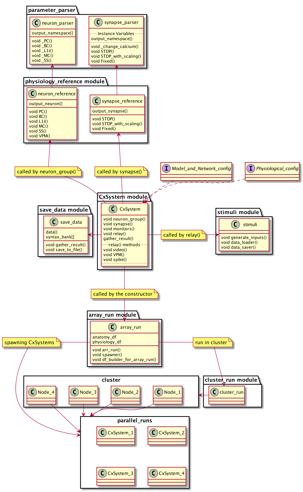

Technical Overview
==================

Selecting Python, C++ or GPU device
------------------------------------

The device is selected in the model and network configuration file. Set the "device" to either :code:`Python`, :code:`Cpp` or :code:`GeNN` (case insensitive). The :code:`Cpp` (C++) device is a safe bet for most applications. :code:`Python` skips compilation, and may be best for minor systems or when devices run into problems. :code:`GeNN` may be beneficial for long non-array runs. 

How the CxSystem works
-----------------------

The CxSystem starts by calling the main object :code:`CxSystem()` in python 2.7 interpreter. At the end of this file, user can name the configuration files which are instructing the system. 

One of the strengths of the CxSystem is the ability to dynamically compile the model. This bypasses the traditional way of hard coding much of the model which would limit flexibility. This flexibility comes with some added complexity in the way the CxSystem builds the devices.

The implemented system employs the Brian2GeNN python module to generate GeNN (GPU enhanced Neuronal Network simulation environment) code for eventually running the Brian2 codes on GeNN. Note that using the GeNN device, CxSystem (via GeNN) only employs one of the GPUs in the system and therefore cannot be used in cluster. In order to understand how this system works, one should initially understand how Brian2GeNN limits Brian2. Most of the exclusions are presented in `Brian2GeNN documentation
<http://brian2genn.readthedocs.io/en/latest/introduction/exclusions.html>`_. Perhaps the most effective limitation is lack of support for using Multiple networks in Brian2, i.e. only the *magic network* can be used. Using the *magic network*, only the "visible" objects, that are explicitly defined in the code, will be collected. In other words, any Brian2 object that is created in a custom class, will not be collected and will eventually raise an error. We have used two solutions to address this issue, Syntax Bank and Global variables: 

Creating a Syntax Bank
````````````````````````

In this method, a syntax string is built for all Brian2 internal objects. These syntaxes are then run after the main object call. \
Suppose the cortical system object is named *CX* and a :code:`NeuronGroup()` object called :code:`NG` is created in a method inside the :code:`CX`: 

::

	NG = NeuronGroup(1, eqs)
	
The :code:`NG` will not be collected for magic network as it is inside a method of :code:`CX`. However, we can anticipate a syntax for this neuron group \
and save it in a syntax bank attribute in :code:`CX`: 

::

	syn1 = "NG = NeuronGroup(1, eqs)"
	CX.syntax_bank = append(CX.syntax_bank, syn1) 

All of the elements of this :code:`CX`.syntax_bank* can then be iterated and run using the dynamic compiler, i.e. :code:`exec` command. Note that all the sub \
objects of a syntax should be saved in syntax_bank as well. For instance, the last example will raise an error since :code:`eqs` is not defined. \
Hence, before running the :code:`syn1`, one should initially run the syntax for :code:`eqs` object. 

This method has a fundamental limitation: first, the syntax bank should run in a hierarchical manner. In previous example, the syntax for :code:`eqs` \
should be run before :code:`syn1`. Similarly, :code:`NeuronGroup()` syntaxes should be run before :code:`Synapses()` and :code:`synapses.connect()` should be run after :code:`Synapses()`. \
This process was manually coded into the main file for running the codes in a hierarchical manner, which we consider an untidy solution.

The syntax bank approach call for prefixes for object names. For instance, all of the :code:`NeuronGroup()` have a prefix of :code:`NG`.

For each neuron group, similar prefixes are also needed for variables such as: 

  + Number of neurons in each group: :code:`NN`
  + Equation: :code:`NE`
  + Threshold value: :code:`NT`
  + Reset value: :code:`NRes`
  + Refraction value: :code:`NRef`
  + Namespace: :code:`NS`

Several prefixes are also demanded for :code:`Synapses()` objects:

  + Synaptic object: :code:`S`
  + Synaptic equation: :code:`SE`
  + Pre Synaptic group equation: :code:`SPre`
  + Post Synaptic group equation: :code:`SPost`
  + Namespace: :code:`SNS`
  + .connect(): :code:`SC`
  + weight: :code:`SW`

And similar prefixes for monitors: 

  + Spike Monitors: :code:`SpMon`
  + State Monitors: :code:`StMon`

Updating Globals()
```````````````````

Although mentioned as a dangerous method in the literature, updating the :code:`Globals()` directly, is a practical approach in our case. This method  \
uses aforementioned prefixes and corresponding variables. However, there is no need for the newly generated variables to *wait* in the syntax bank so to be run after :code:`CxSystem()` module.
They can be implicitly executed while CxSystem is running and still  magic network of Brian2 would be able to access them since they are \
in :code:`Globals()`. Thus, the user does not have to face a manual syntax-executer outside of the main object call. 

Accordingly, most of the :code:`exec` commands inside the main object :code:`CxSystem()` are creating the required variables and making them visible to \
*magic network* of Brian2 by updating the :code:`Globals()`. In the following example, the :code:`NG0` is put into the :code:`Globals()`:

::

	globals().update({'NG0':NG0})

Fig.1 illustrates the schematic of the cortical system internal component: 



   Fig.1 simplified UML diagram of the cortical system
