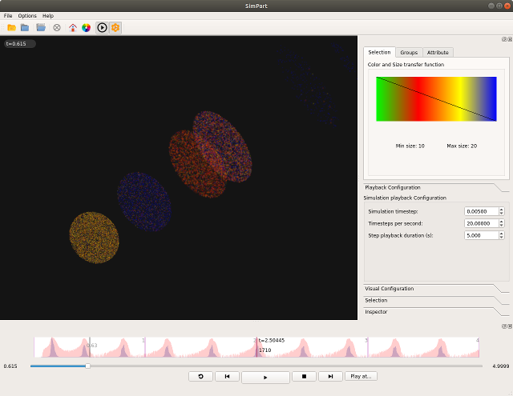

Visualization in ViSimpl
========================

Simulation results from CxSystem2 can be visualized using ViSimpl, a 3D particle-based rendering tool developed by
the `GMRV Lab <http://gmrv.es/gmrvvis/>`_. Currently only spike data can be visualized using this tool.

More information on ViSimpl and binaries for download (currently only for Linux and MacOS) are available
`here <http://gmrv.es/gmrvvis/visimpl/>`_. For visualizing results, please see the tutorial (link here).