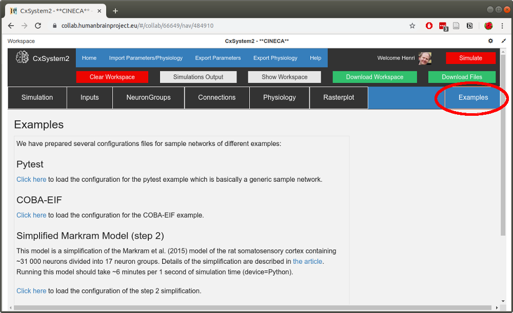

1 - Running an example simulation
=================================

This is the main window of CxSystem2 you should see after opening the application in :ref:`the Brain Simulation Platform <usingbsp>`
(the window for the local browser user interface is similar):

The top panel consists of three rows of buttons. The topmost one has the *Home* and *Help* buttons as well as buttons
for exporting and importing configuration files. The row in the middle has buttons for viewing console output and
for managing files. The last row is mainly for building the network and configuring the simulation. The *Simulate*
in the top-right corner launches the simulation(s).

On lower right part of the browser, you can see a small windows entitled "Status of Simulations". As the name implies, this
window will print out information about the simulation you've submitted the request for. You can temporarily close this
window and open it later on by clicking on the "Simulation Status" button on the top menu.

Now, to run a simple example, let's open up the *Examples* tab:

Under the *Examples* tab you can find networks of different complexity, the simplest ones being on the top. We plan to provide
more examples and our scientific contributions here in the future (you're also free to contribute).

Now, pick the "COBA-EIF" example. After you have loaded the example, hit the Simulate button without changing anything
in the configurations. After a few seconds you should get a window saying that the simulation has been sent to the server.

To see how your simulation is progressing, click on the *Simulations Output* button:

This shows you the console output and it allows you to follow the progress of your simulations.
(If you are running CxSystem2 locally, you can see the output in the terminal window where the server is running.)

After a few minutes, all the simulations should be ready. You should be able to see the resulting
data files by clicking the *Show Workspace* button:

Hooray! You have run your first simulations! See the next section for visualizing the results.