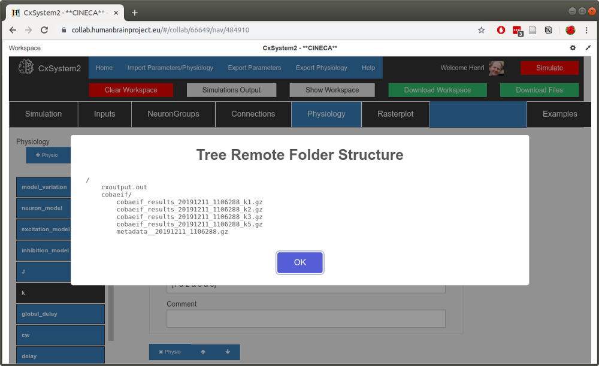
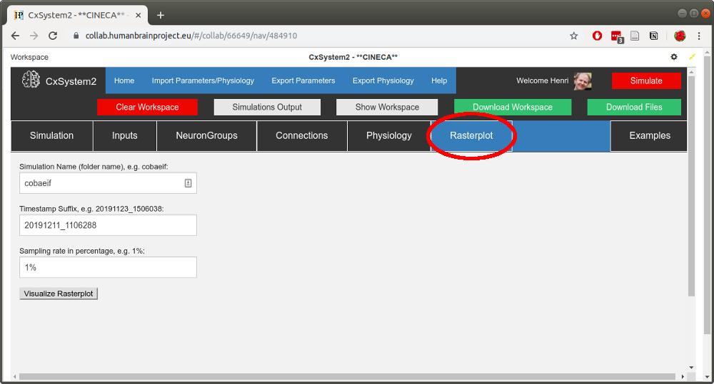
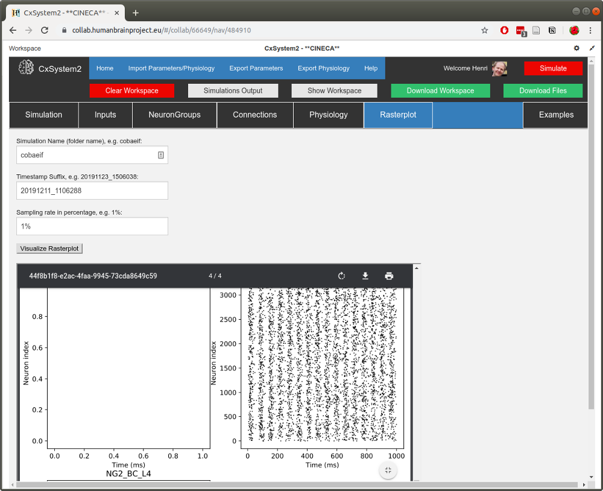
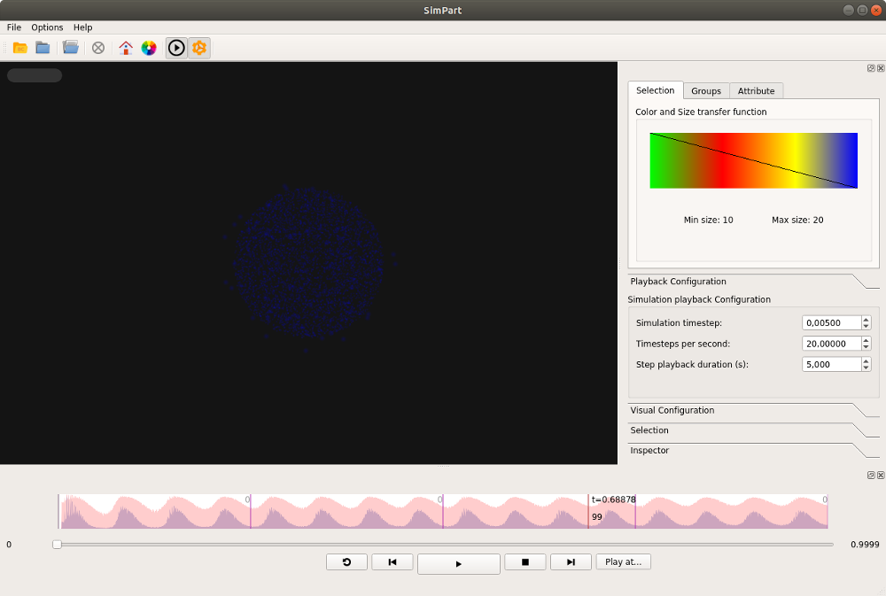

2 - Basic visualization
=======================

Let's continue by visualizing the spike data we created in Tutorial 1:

We actually did a small parameter search for the parameter *k*, which in this configuration means the relative weight
of inhibitory synapses. Thus we have 4 data files containing spikes (plus the metadata file).

Now, from the workspace view (above), copy the timestamp of one of the simulation files (here 20191211_1106288).
Then open up the *Rasterplot* tab:

Fill in the *simulation name* (cobaeif) to the first text field and paste the *timestamp* to the second field.
Leave the *sampling rate* as 1%: the current plotting method will create pdfs that are heavy to render if some of your
simulations have a lot of spikes. (This visualization tool is intended only as a simple screening tool.)

When you have filled in the fields, hit the *Visualize* button. After a few seconds, a PDF with the spike data
should open up:

When you scroll down the pdf, you can see that there are four pages corresponding to the four simulation files.
(In networks with more neuron groups to visualize, a single simulation will occupy multiple pages.) You can see that
with *k=1,2,3* (not that much inhibition) there is little variation in spike rate, but with *k=5* the activity seems
more rhythmic.

