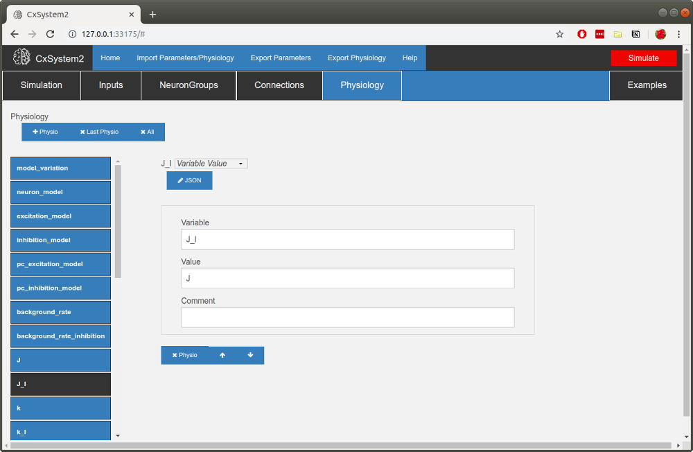

3 - Building a new model
========================

Let's then build a new network composed of adaptive exponential integrate-and-fire neurons.
First, open the *Template network* under the *Examples* tab.

Let's first set the general simulation parameters. You don't need to worry about many of the things here for now.
Just change the :code:`simulation_title` from the template title. Also, check that :code:`init_vms`
(we want to randomize initial membrane voltages) and :code:`multidimension_array_run` are checked
(we want to do a parameter search). Run_in_cluster should be left unchecked. Finally set
the :code:`runtime` parameter (topmost) to 3*second and :code:`device` to Cython.

Now, click the *NeuronGroups* tab. In the template config, there is one excitatory and one inhibitory population,
and this is the same setup we will be using here. Let's however increase the neuron counts a bit.
Pick the spiny stellate (SS) group and change the number of neurons to 10000:

Also change the number of background inputs to 1000. For the basket cell (BC) group, change the number of neurons to
2500 and the number of background inputs to 1000.

Now, let's add some connections. We need to remember here that neuron index 1 corresponds to the excitatory group and
neuron index 2 correspond to the inhibitory group. Let's leave the first connection :code:`S0` as it is
(this is a connection from the input group). Now open up :code:`S1` and from there change the number of synapses per connection
(parameter :code:`n`) to 1. Let's leave the connection probability (parameter :code:`p`) at 10% (0.1).

Let's add the rest of the connections. Click the *+Synapse* button. Then set the parameters for :code:`S2`: we want this to
be an excitatory connection (set :code:`receptor` to :code:`ge`) from the excitatory group to itself
(set :code:`pre_syn_idx` to 1 and :code:`post_syn_idx` to 1).
Set :code:`p` to 0.1 and :code:`n` to 1 again. The rest of the parameters can be left as they are by default.

Now add the inhibitory connections. Click the *+Synapse* button again. Set the parameters for :code:`S3`: we want this to
be an inhibitory connection (set :code:`receptor` to :code:`gi`) from the inhibitory group to the
excitatory group (set :code:`pre_syn_idx` to 2 and :code:`post_syn_idx` to 1). Set :code:`p` to 0.1 and
:code:`n` to 1 again.
Finally, add an inhibitory self-connection with the same :code:`p` and :code:`n`.
You should have a collection of synapses like this:

We're almost there... but we still need to set parameters under the *Physiology* tab. Because we want to simulate
AdEx neurons you need to change the :code:`neuron_model` parameter to :code:`'ADEX'`. (Note that you need to have
single- or double-quotes around the model name -- otherwise CxSystem will think you are referring to a constant in the
configuration file.) Check that :code:`excitation_model` is :code:`'SIMPLE_E'` and
:code:`inhibition_model` is :code:`'SIMPLE_I'`
(exponentially decaying conductance for excitatory and inhibitory receptors). There are some parameters that are
not used in this simulation (like :code:`pc_excitation_model` which is for pyramidal cells), but you don't need to delete
these parameters.

A common scheme to set connection weights is to set weights to excitatory connections and then specify the
inhibitory connections with respect to them. Thus, in this template, there are global variables for each of these:
:code:`J` (E-to-E connections), :code:`J_I` (E-to-I connections), :code:`k` (ratio of I-E connection weight
with respect to E-to-E connection weight) and :code:`k_I` (ratio of I-to-I connection weight
with respect to E-to-I connection weight). We will only be needing one excitatory weight and
one inhibitory weight. Set :code:`J` to 0.5*nS. Then set :code:`J_I` to J and :code:`k_I` to k:

Can you find where the time constants for the receptors are? They are under :code:`receptor_taus`
(the letter tau often signifies a time constant). Change :code:`tau_e` to 5*ms and :code:`tau_i` to 10*ms.

Now we still need to change the neuron model parameters. Go to the bottom of the list of parameters and
open up the *BC* dictionary. Inside you'll find parameters for the BC neuron, which in the template are EIF neurons.
We need to add some parameters to parametrize AdEx neurons. First, however, change the existing parameters:
:code:`C` to 59*pF, :code:`gL` to 2.9*nS, :code:`EL` to -62*mV, :code:`VT` to -42*mV, :code:`DeltaT` to 3*mV and
:code:`V_res` to -54*mV. Then scroll down to the bottom and click the *+row* button three times.
Then in the new empty fields write
down the new parameter values: :code:`a` = 1.8*nS, :code:`b` = 61*pA and :code:`tau_w` = 16*ms.
Finally, change the :code:`V_init_min` parameter to EL-5*mV and :code:`V_init_max` to EL+5*mV.

Once you have done all the changes to the BC neuron group, do the same changes to the SS group.

Now we should have a working simulation config.
But what's the parameter search we wanted to do? We want to see how changing background input rate and changing the
ratio of inhibition-to-excitation changes changes network behavior. There are two notations for parameter search in CxSystem. The first notation is
:code:`{start|end|step}` which has a similar behavior as :code:`numpy.arange(start,end,step)`. For example, setting a parameter to
:code:`{0|1|0.2}` would create an array of following values: :code:`0.0, 0.2, 0.4, 0.6, 0.8`. The next notation is
:code:`{value1 & value2 & value3 & ... }` where the user can add multiple desired values manually. For example, setting a parameter
to :code:`{ 0 & 1 & 100 & 9 }` will create an array of following values:  :code:`0, 1 , 100, 9`. Note that these values can be used at the same time.
As an example, consider we want to add search ranges to the parameters :code:`background_rate` and :code:`k`.
Here we use the curly brace syntax: set :code:`background_rate` as {0|5|2}*Hz (corresponding to 0, 2, 4 Hz) and
:code:`k` as {1 & 3 & 5 & 7}. Now you have defined a 3x4 parameter search of following values:

+-----------------+--+--+--+--+--+--+--+--+--+--+--+--+
| background_rate |0 |0 |0 |0 |2 |2 |2 |2 |4 |4 |4 |4 |
+-----------------+--+--+--+--+--+--+--+--+--+--+--+--+
|k                |1 |3 | 5| 7| 1| 3| 5| 7| 1| 3| 5|7 |
+-----------------+--+--+--+--+--+--+--+--+--+--+--+--+

Finally you can hit the *Simulate* button. When you simulate this on a single CPU core (:code:`number_of_process` is 1)
it should take 30 min - 1 hour to finish. Once the simulation is finished you should be able to see 12 files in your
workspace:

.. code-block:: console

    my_first_model_results_20191216_0901136_background_rate0H_k1.gz
    my_first_model_results_20191216_0901136_background_rate0H_k3.gz
    my_first_model_results_20191216_0901136_background_rate0H_k5.gz
    my_first_model_results_20191216_0901136_background_rate0H_k7.gz
    my_first_model_results_20191216_0901136_background_rate2H_k1.gz
    my_first_model_results_20191216_0901136_background_rate2H_k3.gz
    my_first_model_results_20191216_0901136_background_rate2H_k5.gz
    my_first_model_results_20191216_0901136_background_rate2H_k7.gz
    my_first_model_results_20191216_0901136_background_rate4H_k1.gz
    my_first_model_results_20191216_0901136_background_rate4H_k3.gz
    my_first_model_results_20191216_0901136_background_rate4H_k5.gz
    my_first_model_results_20191216_0901136_background_rate4H_k7.gz

Now you can use the techniques described in Tutorial 3 to visualize the results!